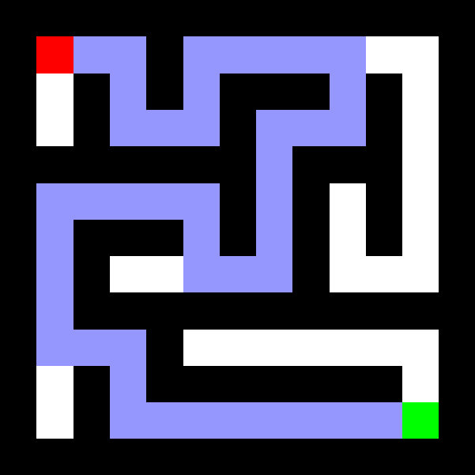
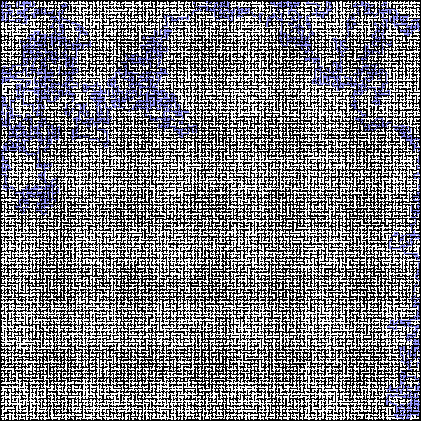

# A* Search Algorithm w/ Maze Generator
This is the A* search algorithm. It takes in a 2D array of values that describe
an environment and finds the shortest path from the start to the goal. This also comes with a breadth first search maze generator,
that provides compatible output. 

These were originally seperate projects, however, I decided it would probably be best to combine them. I have intentions to do more search algorithms like Dijkstra's algorithm, and more maze generators like Kurskal, Prim, and Aldous-Broder. Seeing the pathfinding algorithms solve incredibly complex mazes is always so interesting.

## Examples
11x11 Maze

101x101 Maze

601x601

1001x1001

